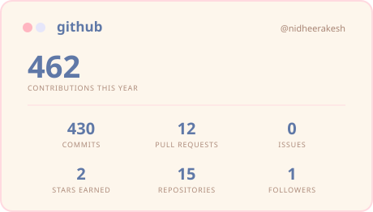
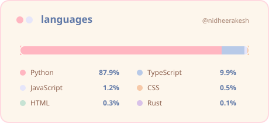
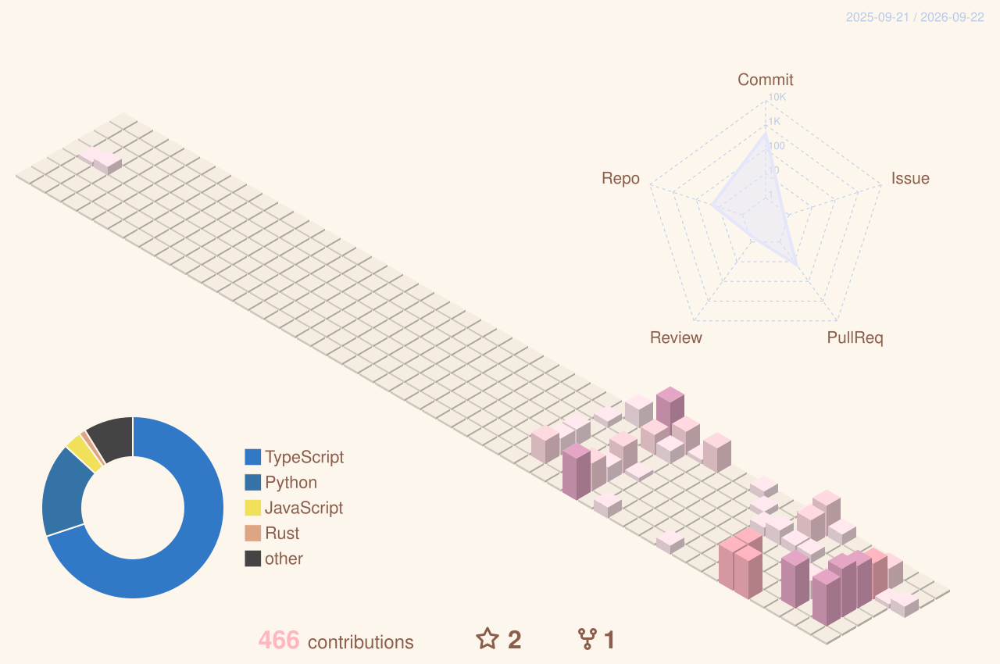
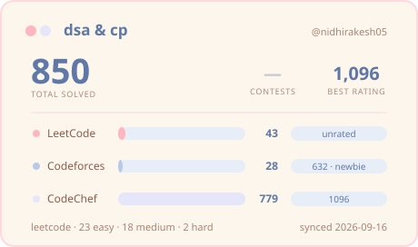
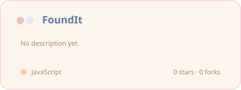
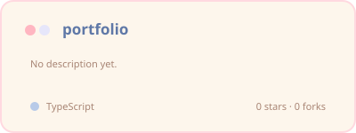
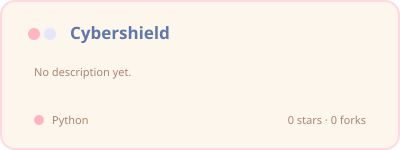
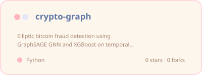

  
   
   
  

  Computer science undergrad at IIIT Kottayam. Most of my time goes to AI and machine 
  learning — LLM applications and healthcare AI especially — with regular detours into 
  full stack and cloud. I like problems where the hard part is the thinking.

 

  <picture>
    <source media="(prefers-color-scheme: dark)" srcset="./assets/headings/currently-dark.png" />
    
  </picture>

  <b>building</b> — LLM applications and healthcare AI 
  <b>learning</b> — full stack development and cloud 
  <b>open to</b> — internships and collaborations

 

  <picture>
    <source media="(prefers-color-scheme: dark)" srcset="./assets/headings/tools-dark.png" />
    
  </picture>

  
  
  
  
  
  
   

  
  
  
  
   

  
  
  
  
   

  
  
  
  
  
   

  
  
   

  
  
  
  
  
  
  

 

  <picture>
    <source media="(prefers-color-scheme: dark)" srcset="./assets/headings/stats-dark.png" />
    
  </picture>

  
  

  

 

  <picture>
    <source media="(prefers-color-scheme: dark)" srcset="./assets/headings/city-dark.png" />
    
  </picture>

  

 

  <picture>
    <source media="(prefers-color-scheme: dark)" srcset="./assets/headings/dsa-dark.png" />
    
  </picture>

  
   
   
  
   
   
  
  &nbsp;
  
  &nbsp;
  

 

  <picture>
    <source media="(prefers-color-scheme: dark)" srcset="./assets/headings/built-dark.png" />
    
  </picture>

<!-- PROJECTS:START -->

  <table>
    <tr>
      <td>
        
      </td>
      <td>
        
      </td>
    </tr>
    <tr>
      <td>
        
      </td>
      <td>
        
      </td>
    </tr>
  </table>

<!-- PROJECTS:END -->

 

  <picture>
    <source media="(prefers-color-scheme: dark)" srcset="./assets/headings/hello-dark.png" />
    
  </picture>

  
  &nbsp;
  

 

  
   
   
  

